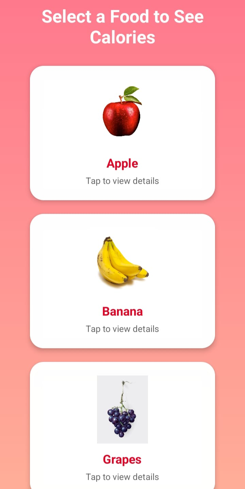
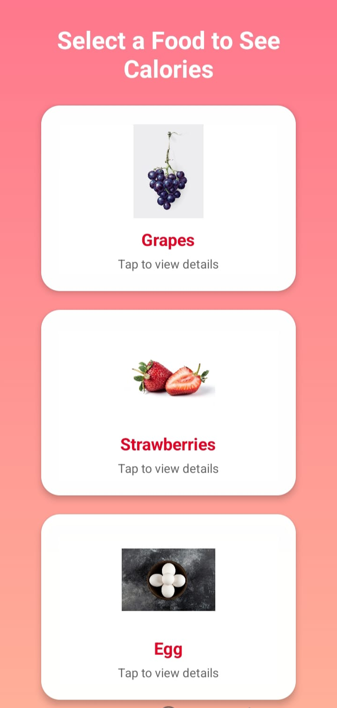
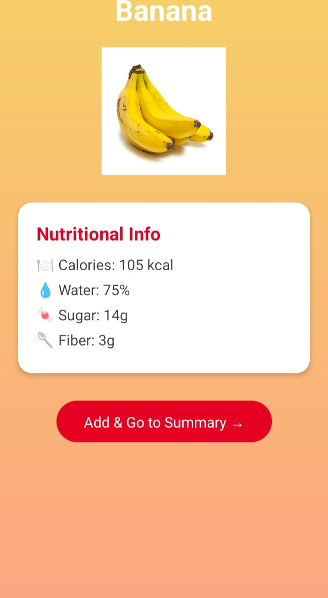
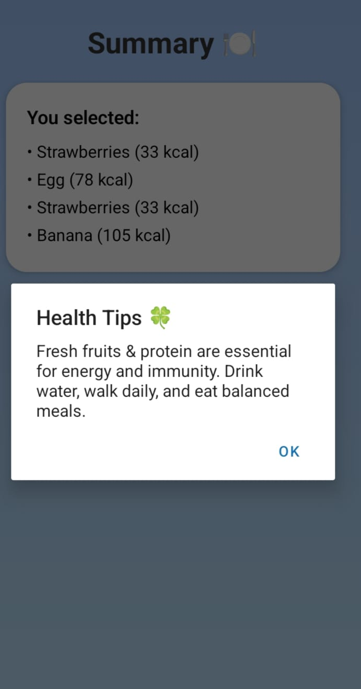

# 🍎 FitTrack – Your Pocket Fitness & Calorie Buddy

Welcome to **FitTrack** – a beautifully designed calorie tracking app built with **React Native** (Expo). Track your meals, view nutritional info, and stay on top of your fitness game — one healthy choice at a time! 🏋️‍♀️🥗

---

## ✨ Features

- 🚀 Splash screen with logo & gradient background
- 🔐 Sign-in screen to begin your journey
- 🍎 Food selection screen (Apple, Banana, Egg, Grapes, Strawberries)
- 📊 Nutritional detail cards (Calories, Water, Sugar, Fiber)
- 📋 Summary screen showing healthy eating tips
- ⭐ "Rate It" screen to collect user feedback

---

## 📱 Screenshots

| Splash Screen | Sign-In Screen |
|---------------|----------------|
|  |  |

| Food Items | More Food Items |
|-------------|-----------------|
|  |  |

| Product Detail | Health Tips (Summary) |
|----------------|------------------------|
|  |  |

| Rating Screen |
|----------------|
|  |

---

## 🛠 Tech Stack

- React Native (Expo)
- JavaScript + Functional Components
- React Hooks: `useState`
- Gradient backgrounds and image cards
- Simple state-based screen switching

---

## 📂 Project Structure

```bash
├── app/
│   ├── index.js
│   ├── SplashScreen.jsx
│   ├── SignSreen.jsx
│   ├── CounterCalorieScreen.jsx
│   ├── FoodDetailScreen.jsx
│   ├── Summary.jsx
│   └── Rate.jsx
│
├── assets/
│   └── images/
│       ├── apple.jpg
│       ├── banana.jpg
│       ├── grapes.jpg
│       ├── egg.jpg
│       ├── stawberry.jpg
│       ├── logo.jpg
│       └── ratei.jpg
│
│   └── screenshots/
│       ├── splash.jpg
│       ├── signin.jpg
│       ├── fooditems.jpg
│       ├── fooditems2.jpg
│       ├── productdetail.jpg
│       ├── healthtips.jpg
│       └── rating.jpg
│
├── .gitignore
├── .gitattributes
├── package.json
└── README.md

